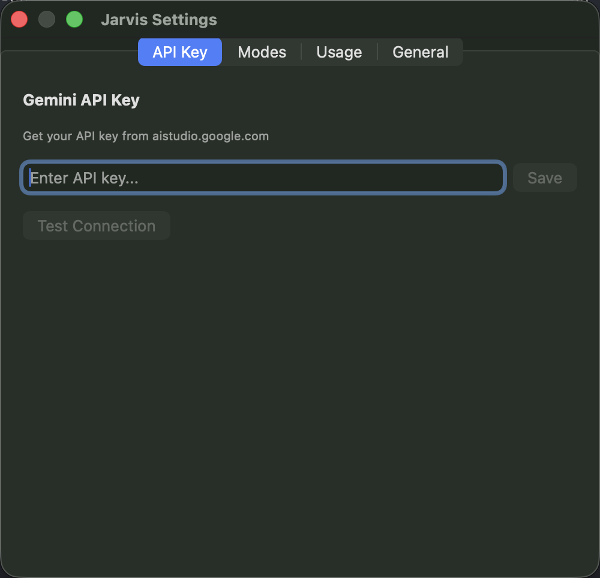

# Jarvis — AI Voice Assistant for macOS

A native macOS menu bar app that turns your voice into action using Google Gemini AI. Hold a hotkey, speak, and Jarvis transcribes, rewrites, or answers — inserting text at your cursor or displaying responses in a floating HUD.



## Features

### Voice Modes
| Mode | Hotkey | What it does | Output |
|------|--------|-------------|--------|
| **Dictation** | `⌥ Space` | Transcribes speech to clean text | Paste at cursor |
| **VibeCode** | `⌥ Space` | Converts spoken ideas into structured AI coding prompts | Paste at cursor |
| **Professional** | `⌥ Space` | Rewrites dictation for professional communication | Paste at cursor |
| **Q&A** | `⌥ Q` | Answers questions directly | Floating HUD |
| **Vision** | `⌥ ⇧ Space` | Analyzes your screen + answers questions about it | Floating HUD |

- **⌥ M** to cycle between modes
- All hotkeys are push-to-talk (hold to record, release to process)
- Custom modes can be created in Settings

### Menu Bar App
- Lives in the macOS menu bar (no Dock icon)
- Icon changes state: idle (waveform) → recording (red) → processing (orange)
- Shows active mode and usage cost in dropdown menu

### Settings
- **API Key** — Securely stored in macOS Keychain with connection test
- **Modes** — View built-in modes, create/delete custom modes
- **Usage** — Monthly cost tracking per model (Flash/Pro) with token breakdown
- **General** — TTS toggle and keyboard shortcuts reference

### Floating HUD
- Borderless, always-on-top response window for Q&A and Vision modes
- Text selection enabled, auto-dismiss after 15 seconds
- Speaker button to read responses aloud (TTS)

### Vision Mode
- Captures the active window via ScreenCaptureKit
- Combines screenshot + voice question in one Gemini API call
- Useful for debugging code, analyzing UI, or reading content on screen

## Tech Stack

| Component | Technology |
|-----------|-----------|
| Language | Swift 6.3 |
| UI | SwiftUI + AppKit hybrid |
| AI Backend | Google Gemini API (2.5 Flash / 2.5 Pro) |
| Audio | AVAudioEngine (WAV/PCM) |
| Hotkeys | [HotKey](https://github.com/soffes/HotKey) package |
| Text Insertion | Accessibility API (AXUIElement) + Pasteboard fallback |
| Screen Capture | ScreenCaptureKit |
| API Key Storage | macOS Keychain (Security framework) |
| TTS | AVSpeechSynthesizer |
| Target | macOS 14.0+ |

## Project Structure

```
Jarvis/
├── JarvisApp.swift                  # App entry point
├── AppDelegate.swift                # Menu bar + pipeline wiring
│
├── Gemini/
│   ├── GeminiClient.swift           # Gemini API (audio + vision multimodal)
│   └── UsageTracker.swift           # Token counting & cost tracking
│
├── Audio/
│   ├── AudioCaptureManager.swift    # AVAudioEngine mic → WAV
│   └── AudioPermissionHelper.swift  # Microphone permission flow
│
├── Modes/
│   ├── Mode.swift                   # Mode model (GeminiModel, OutputType)
│   ├── BuiltInModes.swift           # 5 preset modes with system prompts
│   ├── ModeManager.swift            # Active mode state & cycling
│   └── CustomModeStore.swift        # JSON persistence for custom modes
│
├── System/
│   ├── HotkeyManager.swift          # Global hotkey registration
│   ├── TextInsertionService.swift   # Text insertion at cursor
│   ├── ScreenCaptureService.swift   # Window/screen capture
│   └── PermissionsManager.swift     # Permission checks & guides
│
├── UI/
│   ├── SettingsView.swift           # Settings window (4 tabs)
│   ├── HUDWindow.swift              # Floating response window
│   ├── HUDContentView.swift         # HUD SwiftUI content
│   ├── OnboardingView.swift         # First-launch permission guide
│   └── RecordingIndicatorView.swift # Recording visual feedback
│
├── Services/
│   ├── KeychainService.swift        # Keychain API key storage
│   ├── TTSService.swift             # Text-to-speech
│   └── LoggingService.swift         # File logging
│
└── Resources/
    ├── Assets.xcassets              # App icons
    ├── Info.plist                   # LSUIElement, usage descriptions
    └── Jarvis.entitlements          # Audio input entitlement
```

## Installation

### From DMG
1. Download `Jarvis-1.0.dmg`
2. Open the DMG and drag Jarvis to Applications
3. Launch Jarvis from Applications

### Build from Source
```bash
# Clone
git clone git@github.com:Parthee-Vijaya/JarvisHUD.git
cd JarvisHUD

# Build
xcodebuild -project Jarvis.xcodeproj -scheme Jarvis -configuration Release build

# Or build DMG
chmod +x build-dmg.sh
./build-dmg.sh
```

**Requirements:** Xcode 26+ with macOS 14+ SDK

## Setup

1. **Get a Gemini API key** from [aistudio.google.com](https://aistudio.google.com)
2. Launch Jarvis — the onboarding guide will walk you through permissions
3. Click the menu bar icon → **Settings** → paste your API key → **Save**
4. Click **Test Connection** to verify
5. Grant **Microphone** and **Accessibility** permissions when prompted

## Usage

### Dictation (default mode)
1. Open any text editor (Notes, TextEdit, VS Code, etc.)
2. Click where you want text inserted
3. Hold **⌥ Space**, speak, release
4. Text appears at your cursor

### Q&A
1. Hold **⌥ Q**, ask your question, release
2. Answer appears in a floating HUD window

### Vision
1. Have the window you want to analyze in focus
2. Hold **⌥ ⇧ Space**, ask your question about what's on screen, release
3. Jarvis captures the window + your audio and responds in the HUD

### Switching Modes
- Press **⌥ M** to cycle through modes
- Or click the menu bar icon → **Switch Mode**
- Create custom modes in Settings → Modes tab

## Data & Privacy

- **API key** is stored in the macOS Keychain (never on disk)
- **Audio** is captured in memory only, never saved to disk
- **Screenshots** (Vision mode) are held in memory during API call, then discarded
- **Logs** are written to `~/Library/Logs/Jarvis/jarvis.log`
- **Usage data** is stored locally at `~/Library/Application Support/Jarvis/usage.json`
- All data stays on your machine — only API calls go to Google's Gemini service

## Pricing

Jarvis uses Google Gemini API pricing. Usage is tracked in Settings → Usage tab.

| Model | Input | Output |
|-------|-------|--------|
| Gemini 2.5 Flash | $0.075 / 1M tokens | $0.30 / 1M tokens |
| Gemini 2.5 Pro | $1.25 / 1M tokens | $5.00 / 1M tokens |

Most modes use Flash. Only VibeCode uses Pro for higher-quality prompt generation.

## License

MIT

---

Built with Claude Code.
